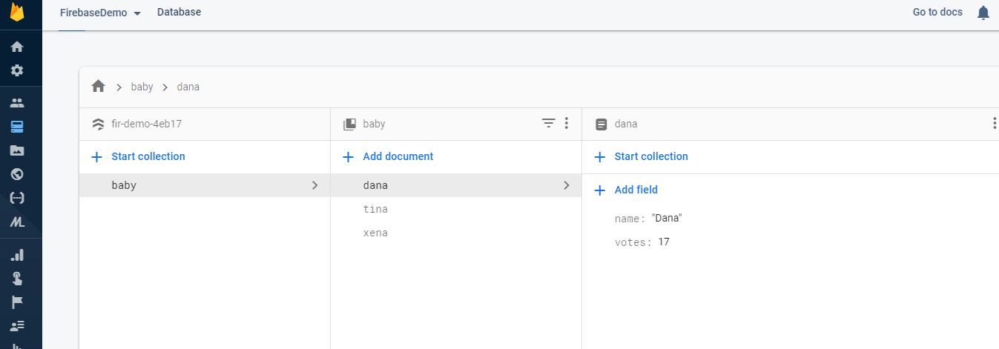

# flutter firestore demo

This project is demo of simple read and update of firestore data using [cloud_firestore](https://pub.dev/packages/cloud_firestore) package.

## Getting Started

This project is a demo of the firestore.
Please follow [this](https://codelabs.developers.google.com/codelabs/flutter-firebase/#5) flutter codelabs tutorial.

As shown in tutorial, you will need to create a firebase application with a firestore database.

To connect with the firebase, App needs a specific google-service.json file at android/app directory
and to read that google-service.json file, we will need to add google-serive plugin dependency inside both build.gradle files.

Our firestore database is like this 
